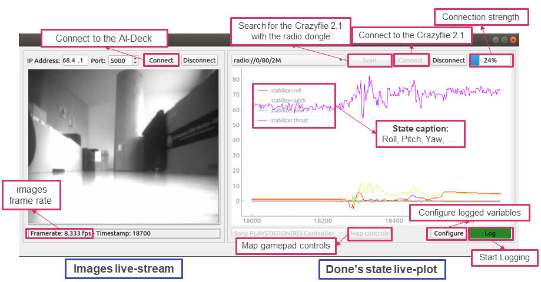
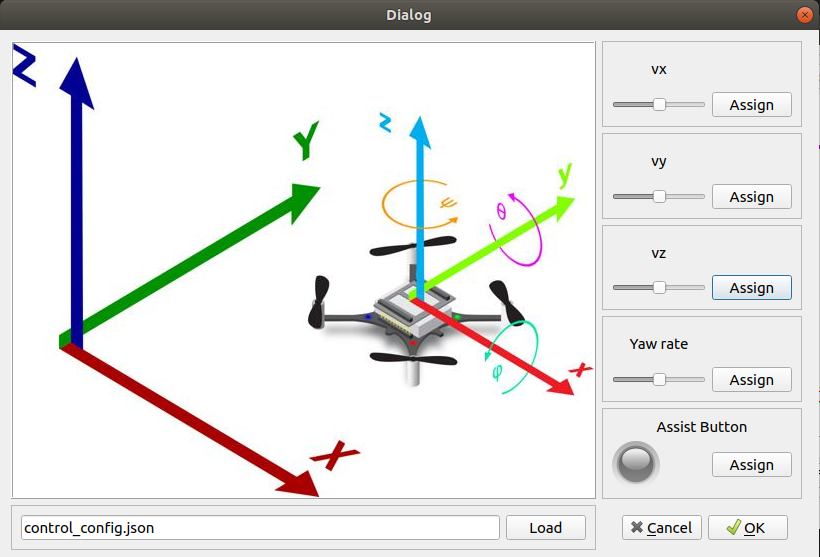
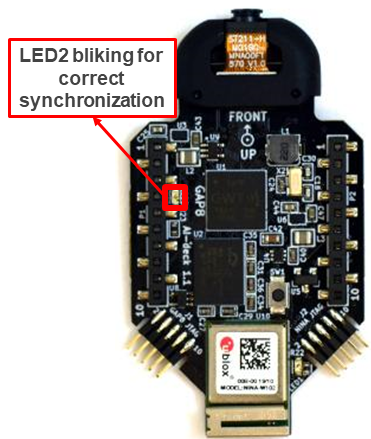

# Dataset collection framework

This is the **dataset framework collector** for the _Crazyflie2.1_ combined with the AI-deck, Flow deck v2, and (optional) Multi-ranger Deck.

This application allows for on-the-fly dataset collection, specifically:
- Collecting images with the AI-Deck's camera, and send them via Wi-Fi to the laptop
- Collecting the drone's state (Roll, Pitch, Yaw, Thrust ...) and send it via Bluetooth to the laptop.

The two transmission flows (Wifi & bluetoot) are totally indipendent, a python script allows for offline matching of images and state.

The repository of the dataset framework collector is so structured:
1. **STM32 code** for the drone's state acquisition and bluetooth transmission -> `crazyflie_firmware_patch/`
2. **AI-deck code** for camera acquisition and wifi transmission -> `GAP8_streamer/`
2. **Python app** with the dataset collector framwork Graphical User Interface (GUI), which receives the images and state on the laptop, and label's post processing scripts -> `dataset_collector/`

# How to setup dataset collector framework

Make sure to clone recursively

~~~~~shell
git clone git@bitbucket.org:autonomouscv/dataset_collector_framework.git --recursive
~~~~~

To get the datasetcollector app running there are three main steps required:

**1. Flash the firmware on the Crazyflie STM32 Board**  -> `crazyflie_firmware_patches/`

**2. Flash the firmware on the AI Deck**                -> `GAP8_streamer/`

**3. Open the dataset collector python app**    -> `dataset_collector/`

**4. Collect a new dataset**    -> stored in `dataset_collector/dataset/`

### Prerequisites:

- Install the GAP sdk by following [Greenwaves' instructions](https://greenwaves-technologies.com/setting-up-sdk/).
- Download the [crazyflie-firmware (tag 2020.09)](https://github.com/bitcraze/crazyflie-firmware/tree/2020.09) to `pulp-dronet/dataset_collection_framework/external/`
- Install [crazyflie-clients-python (tag 2020.09.01)](https://github.com/bitcraze/crazyflie-clients-python/tree/2020.09.1)

### Note:
- There have been some [problems if USB 3.0 was enabled](https://github.com/bitcraze/crazyflie-lib-python/issues/130) when using the crazyradio dongle (very long time for scanning the devices), hence it is recommended to use USB2.0 in the VM settings.

# 1. Flash the firmware on the Crazyflie STM32 Board
First we need to change to the folder where the crazflie STM32 software is located. First go to the clone of this repo and execute:

~~~~
cd crazyflie_firmware_patch/dataset_collection_app
~~~~

Plug in your crazyflie dongle and [set the crazyflie into flash mode](https://www.bitcraze.io/documentation/repository/crazyflie-firmware/2020.06/building-and-flashing/flashing/) (Turn off crazyflie and turn on by holding the on button for 3 seconds). The blue LED's should blink now.
Next the project must be build. There will be alot of warnings since are some definitions are not yet since for the compiler. If you dont face any errors the compilation should be fine. Make sure you activated the python environment where the bitcraze packages are installed, if you followed the steps in [README.md](README.md) it should be the default environment when you open a new terminal.

~~~~
make clean all
~~~~

Now if there no errors occured the code can be falshed onto the crazyflie with:

~~~~
make cload
~~~~

As soon as the flashing is done the crazyflie will be automatically reseted.

#### Remarks to be mentioned:
- Some files inside the original `crazyflie-firmware` hade been changed. The modified files are stored in `crazyflie_firmware_patch/crazyflie-firmware-modified-dataset/`. Therefore, the `Makefile` masks some files of the original gap_sdk to include these files that have been modified.

# 2. Flash the firmware on the AI Deck
Next we flash the firmware for the images wifi transmission on the AI-Deck.

**Setup gap_sdk and JTAG programmer:**

Before flashing the gap8 chip on the AI Deck make sure you plugged in the Olimex ARM-USB-OCD-H and connected it to the VM. Also make sure the JTAG is connected according to [this guide](https://github.com/bitcraze/AIdeck_examples/blob/master/docs/getting-started/jtag-programming.md).
In order to program GAP8 only two commands are needed (source gap_sdk + export the jtag programmer configuration):

~~~~
source home/<yourusername>/gap_sdk/configs/ai_deck.sh
export GAPY_OPENOCD_CABLE=$HOME/work/gap_sdk/tools/gap8-openocd/tcl/interface/ftdi/olimex-arm-usb-ocd-h.cfg
~~~~

**Flash GAP8 (AI-Deck)**

Now we are ready to Flash GAP8:

~~~~
cd GAP8_streamer/wifi_jpeg_streamer
make clean all
make image flash io=host
~~~~

Doublecheck if flashing was successful. You should get a similar output:

~~~~
--------------------------
begining flash session (hyperflash)
--------------------------
load flasher to L2 memory
Loading binary through JTAG
Warn : Burst read timed out
Instruct flasher to begin flash per se
device struct address is 470093656
going to wait on addr GAP_RDY
wait on gap_rdy done witg buff ptr 0 469828864
loading image with addr 469828864 addr_min 469828864 and size 48160
load image done
flasher is done, exiting
--------------------------
flasher is done!
--------------------------
--------------------------
Reset CONFREG to 0
--------------------------
Info : JTAG tap: gap8.cpu tap/device found: 0x149511c3 (mfg: 0x0e1 (Wintec Industries), part: 0x4951, ver: 0x1)
GAP8 examine target
RESET: jtag boot mode=3
DEPRECATED! use 'adapter [de]assert' not 'jtag_reset'
~~~~

Now the AI Deck software is up and running, and it is streaming images via Wi-Fi.

#### Remarks:
- Flashing the AI-Deck (GAP8) does not always work on the first try. Sometimes it is necessary to flash multiple times (you should notice an error if that happens)
- To get the image streamer working some files inside the gap sdk hade been changed. The modified files are stored in `GAP8_streamer/gap_sdk_modified`. Therefore, the `Makefile` masks some files of the original gap_sdk to include these files that have been modified. By doing so, you don't have to modify the sdk.

# 3. Open the dataset collector python app

We will now open the Graphical user interface that allows to collect a dataset.

**Setup conda environment to run the python app**

Install conda if you don't have it already ([link](https://docs.anaconda.com/anaconda/install/linux/)).

When you have anaconda installed you can proceed with creating the conda environment:

~~~~
conda env create -f conda_dependencies.yml
~~~~

Now we can open the Dataset Collector User interface with the following command: (**NOTE:** First you must plug in a joystick to control the crazyflie)

~~~~
cd dataset_collector/
conda activate dataset_collection_framework
python datasetcollector_main.py
~~~~

Now You can start collecting the dataset with the GUI.

# 4. Collect a new dataset

Let's take a look at the GUI

We will need to do 3 steps for starting the acquisition of a dataset:
1. Map the gamepad commands
2. Connect to the main Controll Board of the Crazyflie 2.1 (STM32F4) -> it logs the drone's state via bluetooth (Crazyradio PA)
3. Connect to the AI-Deck (GAP8 SoC) -> it logs images via Wi-Fi (NINA Module)
4. Start Logging

### 1. Map the gamepad commands

- Press on "Map controls" on the bottom right
- Assign each control of the drone by pressing on "Assign" and then moving the corresponding command on your gamepad. You will see the slider moving if the assignment went successfully
- Press on "OK" to store the configuration. A `control_config.json` file will be saved locally with your gamepad mapping.

### 2. Connect to the main Control Board of the Crazyflie 2.1 (STM32F4)

Right side of the Dataset collector GUI.

- Turn on the Crazyflie 2.1
- Plug the [Crazyradio PA](https://www.bitcraze.io/products/crazyradio-pa/) into your PC. Make sure that it is connected to the VM if you are not on native Linux OS.
- Press on the "Scan" button on the right side. You should find `radio://0/80/2M`. If not, doublecheck the two previous steps.
- Click on "connect" button on the right side.
- **NOTE:** you will see the variables plotted in real-time **only once you start logging**. So nothing should happen at this step.

### 3. Connect to the AI-Deck

Left side of the Dataset collector GUI.

- Make sure that you flashed the correct AI-Deck firmware in `GAP8_streamer/wifi_jpeg_streamer/`
- if the upper lest LED of the AI-Deck started blinking (LED2), then the synchronization between the two boards was successful. This means that the AI-deck is transmitting images. See the image below.
- AI-deck now opens a Wi-Fi access point called "Bitcraze AI-deck example"
- Connect your laptop point-to-point to "Bitcraze AI-deck example" with the Wi-Fi board integrated in your laptop.
- Click on "connect" button on the left side.
- You will see the images in real-time, but they are not being saved on your PC (they will be saved only when you press the "Log" button).

### 4. Start Logging

- Press on "Configure" button on bottom left to configure which variables you want to log. **Note:** the variables that you can log are in the central section of the configuration window. If this shows up empty, then you did not connect the GUI to the drone (the GUI fetches the logging variables from the runtime). Click connect first.

- Create a Group for logging the variables that you want, click on the "save" button and then exit the window

- Whenever you are ready to start the dataset acquisition, press the "Log" button on the bottom right.
- Now you will see the drone's state plotted on the right

## Output of the dataset collector

- **The images will be saved in this folder:** `dataset_collector_framework/dataset_collector/dataset/acquisition#/images`

- **The drone's state will be saved in this `csv` file:**  `dataset_collector_framework/dataset_collector/dataset/acquisition#/state_labels_DroneState.csv`

**NOTE:** each acquisition will not overwrite the previous one. Each acquisition will create a new folder inside the `dataset_collector_framework/dataset_collector/dataset/` folder with consecutive numbering (`acquisition1`, `acquisition2`, ...).

# Post-processing the dataset labels

#### Match images and drone's state labels

After collecting the drone's state (roll pitch yaw) and images separately, we must associate each image with the temporal-closest state label.
This script does so.

**Inputs:**

`--data_path` specifies the acquisition# in folder `dataset_collector_framework/dataset_collector/dataset/`. From this folder it authomatically parses:
- the labels in `state_labels_DroneState.csv`
- all the images in the `images/` folder.

**Output:**
- A new .csv file `labeled_images.csv` with correspondence between image-and-state. Extra states collected are removed (the logging rate for the state is higher than the framerate of the images)

~~~~
cd /dataset_collector_framework/dataset_collector/dataset_tools/
python dataset_post_processing.py --data_path=acquisition1
~~~~

#### Dataset viewer

After creating the `labeled_images.csv` we can use the `pulp-dronet/dataset_visualizer` to inspect both the images and labels.

We also provide inside this repo a lightweight opencv viewer

~~~~
cd /dataset_collector_framework/dataset_collector/dataset_tools/
python image_viewer.py --data_path=acquisition1
~~~~

- **Scrolling images:** use the `a` and `d` key button to go to the previous-next image.
- In the central column you can read the labels.
- With the "Load" button at bottom-right you can load a different folder.
